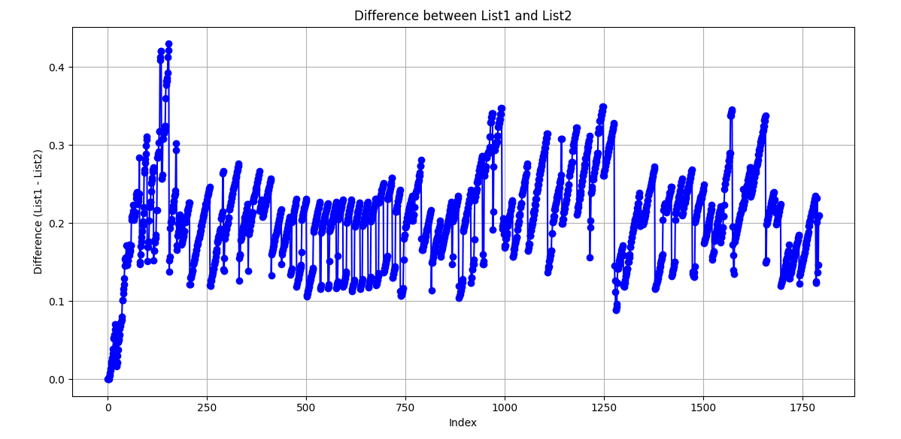

# Q&A

> So do I understand correctly that the x-axis gives the transmitted bitrate per stream, i.e., the total bitrate is 3 times the value on the x-axis and the available bitrate is `5 Mbps` (correct?)

Yes, the transmitted bitrate per stream in x-axis, and the latency in y-axis. The total bitrate is 3 streams which means 3 times value on the x-axis. The traffic generator is in the application layer(we set the flow rate in there), the bottleneck(available bitrate) is set at the data link layer. Therefore, the bandwidth perceived at the application layer is less than `5Mbps`, including header overhead for UDP and so on.

> Mininet will count the actual computation/execution time as the packet latency, which is just a few `(3 to 4) milliseconds`  for low loads up toe `1.1 Mbps` per flow. However, for high loads above `1.5 Mbps` per flow, Mininet will experience delays on the order of `1 second` or more, correct?

The Mininet can creates a realistic virtual network, running real kernel, switch and application code, on a single machine (VM, cloud or native)(taken from [web](http://mininet.org/)). So It is a emulation based on real physical hardware. Based on hardware, the Mininet will count the actual computation/execution time as the packet latency. It using the system time(real physical time) for scheduling on real hardware. 

* It's just `3-4ms`  for low loads up to `1.1 Mbps` per flow. Delay is mainly due to processing delay and link delay.
* As the traffic increases, between `1.1 Mbps` and `1.4 Mbps`, the delay will increase, where the increase in delay comes from the gradual congestion and jitter of the network. 
* For high loads above `1.5 Mbps` per flow, latency will gradually increase due to congestion from `100ms` to large than `1s`. There latency mainly due to long queues in switches.

> What is the meaning of the NS3-P4 Simulator time? Is this (i) the measured wall clock computation time of the simulation running (executing), or (ii) is this the packet latency obtained from the simulations? If it is the latency obtained from the simulations, then the simulation gives the correct (“true”) packet latency, correct? Or what effects could cause the packet latency from the simulations to be different from the “true” packet latency in a real practical P4 switch (with sufficient computation power)?

**(i)** Four simulation time modes are implemented in ns-3: **default**, realtime, distributed, null-message. We are using the default.
The default time mode, It's a [Discrete-event_simulation(DES)](https://en.wikipedia.org/wiki/Discrete-event_simulation), different from the real system time. So It's not the measured wall clock computation time. 

**(ii)** *The delay is from the simulations. The simulation in ns-3 with p4 simualtor is able to give the correct packet latency. *

The packet latency obtained from the simulation based same with the method in bmv2.  The function of the P4 switch is to use program calculation instead of hardware virtualization. Although real physical time is used, the times (such as packet dequeuing time) are calculated similarly. Its design idea for the queue is to poll multiple priority queues based on the packet processing speed given by the user (such as `1000 packets/s`), from high priority to low. So roughly a `thousand packets per second` can be dequeued and sent from the P4 switch into the network. Each data packet entering the switch will be tagged with the entry time, and the order of exiting the queue will be selected based on the entry time.At this time, it can be found that there is no difference in the core of P4switch in the two simulation methods (Mininet+bmv2 or ns3+p4simulator), including the time model and behavior of the p4 switch. 

*The emualted P4 switch can't give  power and the mis-match of mininet and bmv2 is also cause the different result.*

The bmv2 is a simualtion art P4 switches and Mininet is emualtor. If we want to set a bottleneck for our network, we need to set in the bmv2 with packet processing speed. With in-sufficient speed we can got the bottle-neck in the queue of bmv2 not the bottle-neck in Mininet.  

And for the **mis-match**, by testing the delay of each part, it is found that when the packet enters and exits the switch and the packet is propagated in several links, part of the delay comes from the link, so it can be assumed that mininet and bmv2 are not completely matched, and the bottleneck is Not controlled by the queue manager inside the switch. However, using ns-3 to completely use software simulation does not have the above problems. 

For this part, I have a simple test in Mininet: Measure the time delay for packages get through the switch s1.
The y-axis is the latency in `[s]`. And the x-axis is the packets number.

Measure the time delay between out from switch s1 and get in switch s2.

Therefore, In Mininet, the queuing may not only in P4 switch, because in real implementation, the bmv2 matches the mininet not too much(As I think, that maybe have some limits, and If you find anything, please give us feedback!).

> Follow-up question: do you have the confidence intervals for these plotted mean latency values? We expect to see higher variance, i.e., wider confidence intervals with Mininet, especially for high loads, correct? In contrast, confidence intervals should stay tight with simulation, even for high loads, correct?

Because time is limited, I didn't drawing that aspect of the confidence intervals. If we draw that, we will have wider confidence intervals with Mininet, and the confidence intervals should stay tight with simulation. 

Typically, when designing an simulator we can add jitter or randomness by: random number generator (RNG), automatic packet loss rate, noise and interference, parameter perturbation, etc. Currently the ns-3 p4simualtor does not have randomized jitter, and there is some uncertainty only in the queue, and in the ns-3 link.